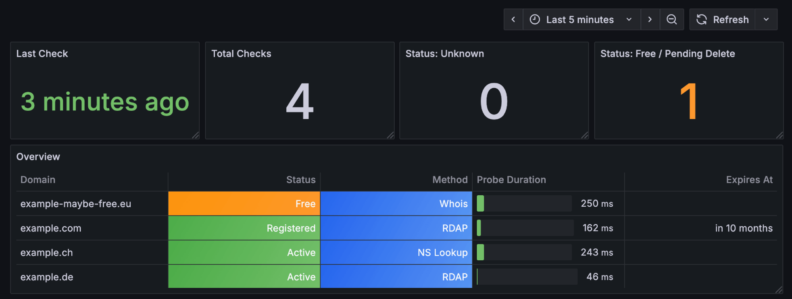

# Domain Exporter

Prometheus domain details exporter using RDAP, Whois and NS Lookup.

## Getting Started

1. Create a `config.yml` and `docker-compose.yml`: Examples below
2. Run `docker compose up`

## Limitations

- ✅ Domain status is requested through RDAP, falls back to Whois and as NS lookup as last ressort
- 📅 Expiry Date is only available on a subset of top-level domains due to privacy constraints

## Configuration

Configuration can be passed through a config.yml or as environment variables:

config.yml

```yaml
check_interval_in_seconds: 86400

logging:
  level: info # one of (debug, info, warn, error)
  format: text # one of (text, json, console)

domains:
  - example.com
```

docker-compose.yml

```yaml
services:
  domain-exporter:
    image: ghcr.io/korbiniankuhn/domain-exporter:1.0.0
    container_name: domain-exporter
    ports:
      - 127.0.0.1:2112:2112
    volumes:
      - ./config.yml:/domain-exporter/config.yml:ro
```

## Monitoring

Prometheus metrics are exported under [localhost:2112/metrics](localhost:2112/metrics)

domain_status: 0=Unknown, 1=Free, 2=PendingDelete, 3=Registered, 4=Active

domain_probe_method: 0=Failed, 1=RDAP, 2=Whois, 3=NS_Lookup

```yaml
# HELP domain_check_timestamp_seconds Unix timestamp of the last check
# TYPE domain_check_timestamp_seconds gauge
domain_check_timestamp_seconds 1.759771491978996e+09
# HELP domain_check_total Total number of domain checks
# TYPE domain_check_total counter
domain_check_total 4
# HELP domain_expires_at Expiry date of the domain as a Unix timestamp
# TYPE domain_expires_at gauge
domain_expires_at{domain="example.com"} 1.7865936e+09
# HELP domain_probe_duration_seconds Duration in seconds of the domain probe
# TYPE domain_probe_duration_seconds gauge
domain_probe_duration_seconds{domain="example-maybe-free.eu"} 1.43701925
domain_probe_duration_seconds{domain="example.ch"} 0.375900791
domain_probe_duration_seconds{domain="example.com"} 0.153589416
domain_probe_duration_seconds{domain="example.de"} 0.107726875
# HELP domain_probe_method The method used for probing the domain
# TYPE domain_probe_method gauge
domain_probe_method{domain="example-maybe-free.eu"} 2
domain_probe_method{domain="example.ch"} 3
domain_probe_method{domain="example.com"} 1
domain_probe_method{domain="example.de"} 1
# HELP domain_status Status of the domain
# TYPE domain_status gauge
domain_status{domain="example-maybe-free.eu"} 1
domain_status{domain="example.ch"} 4
domain_status{domain="example.com"} 3
domain_status{domain="example.de"} 4
```

## Grafana

A prebuilt dashboard is [here](dashboard.json)



## Credits

- [https://github.com/likexian/whois](https://github.com/likexian/whois)
- [https://github.com/likexian/whois-parser](https://github.com/likexian/whois-parser)
- [https://github.com/openrdap/rdap](https://github.com/openrdap/rdap)
- [https://github.com/spf13/viper](https://github.com/spf13/viper)
- [https://github.com/spf13/cobra](https://github.com/spf13/cobra)
